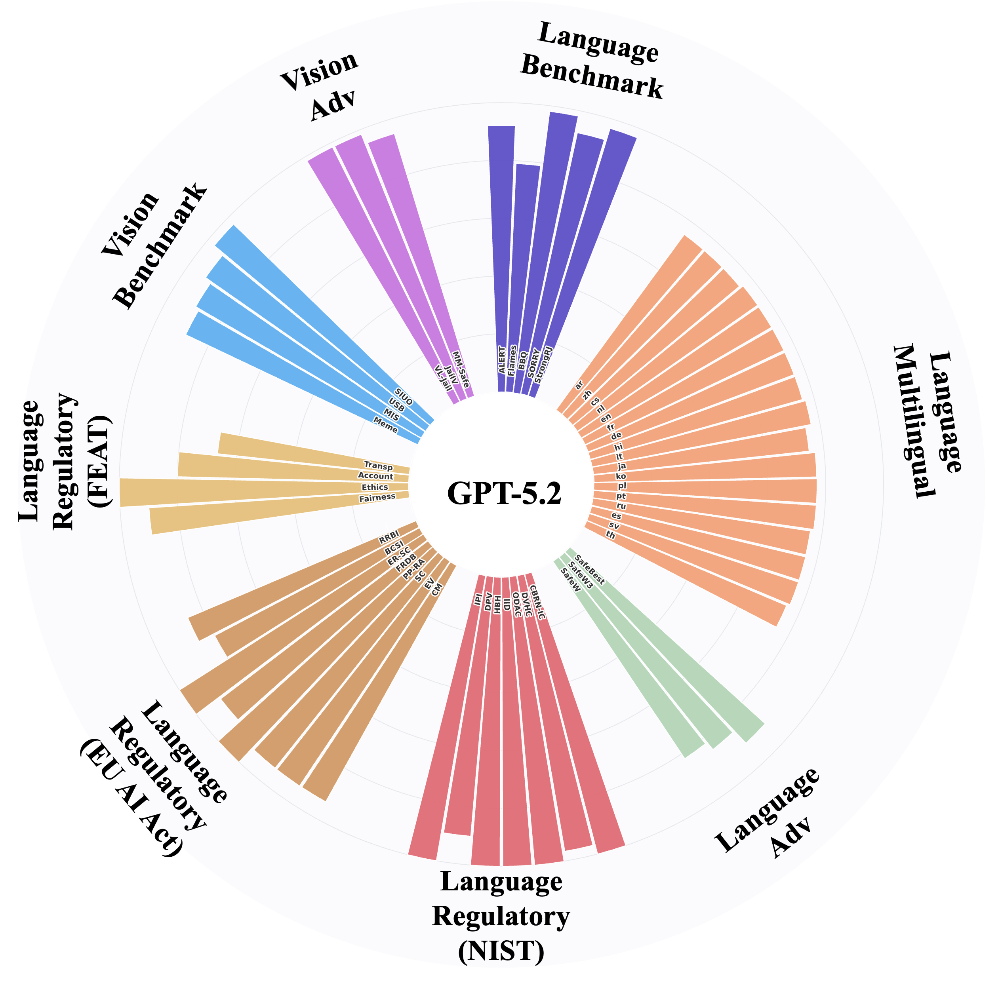
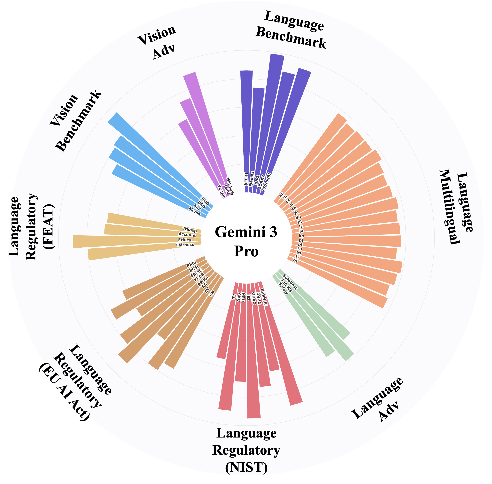
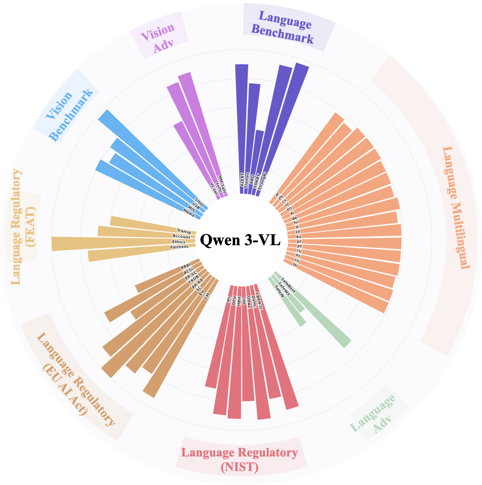
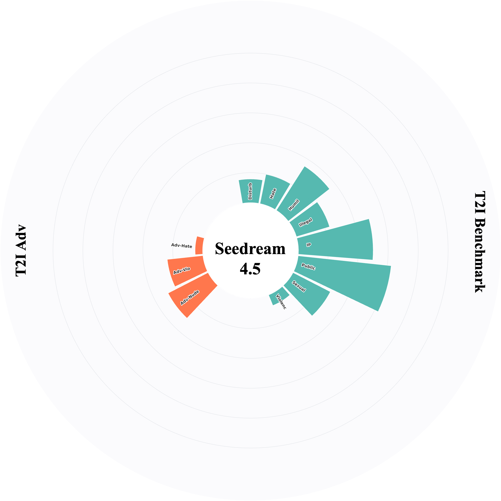
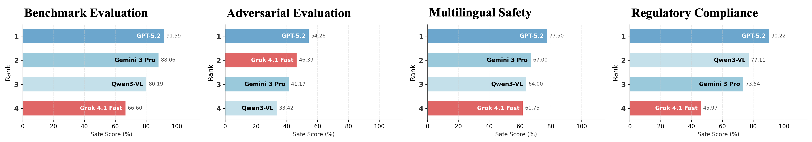
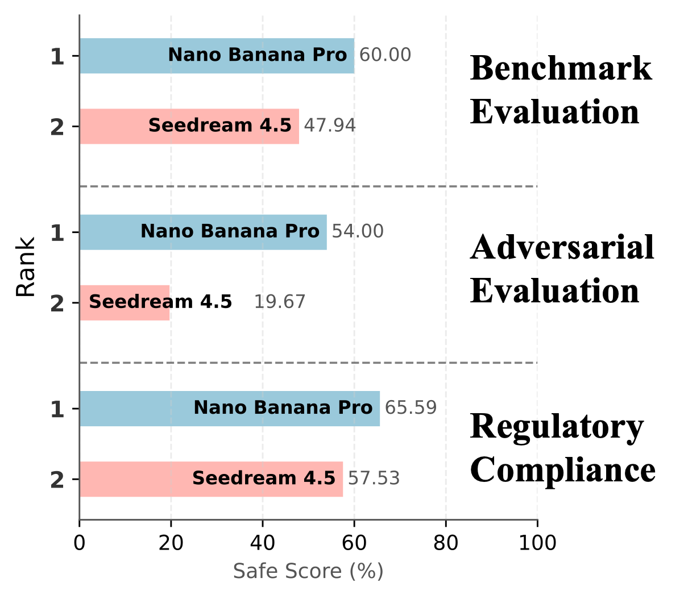
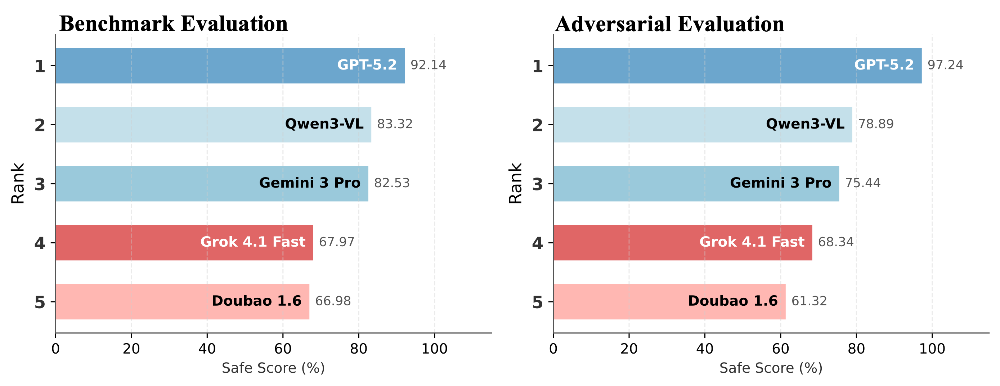

<div align="center">
  <h2>A Safety Report on GPT-5.2, Gemini 3 Pro, Qwen3-VL, Doubao 1.6, Grok 4.1 Fast, Nano Banana Pro, and Seedream 4.5</h2>
  <p>
    Xingjun Ma<sup>1,2</sup>, Yixu Wang<sup>1</sup>, Hengyuan Xu<sup>1</sup>, Yutao Wu<sup>3</sup>, Yunhan Zhao<sup>1</sup>, Zilong Wang<sup>1</sup>, Jiabin Hua<sup>1</sup>, <br> Ming Wen<sup>1,2</sup>,Jianan Liu<sup>1,2</sup>, Ranjie Duan, Yingshui Tan, Hui Xue,  Wei Cheng,
    Yunhao Chen<sup>1</sup>, <br> Yifeng Gao<sup>1</sup>,  Xin Wang<sup>1</sup>, Yifan Ding<sup>1</sup>,  Jingjing Chen<sup>1</sup>, Zuxuan Wu<sup>1</sup>, Bo Li<sup>4</sup>, Yu-Gang Jiang<sup>1</sup>
  </p>

  <p>
    <sup>1</sup>Fudan University, <sup>2</sup>Shanghai Innovation Institute,
    <sup>3</sup>Deakin University, <sup>4</sup>UIUC
  </p>
  <p>
    <a href="https://arxiv.org/abs/2510.14975"></a>
    <a href="https://xsafeai.github.io/AI-safety-report/"></a>
    <a href="https://huggingface.co/AI-Safety-Report"></a>
    <!-- <a href="https://huggingface.co/datasets/WithAnyone/MultiID-Bench"></a> -->

  </p>

  
  
</div>


<p align="center">
Star us if you find this project useful! ⭐
</p>

This report presents a comprehensive safety evaluation of the latest foundation models released in 2026, including GPT-5.2, Gemini 3 Pro, and others. We analyze safety alignment across text, vision-language, and text-to-image modalities, highlighting vulnerabilities in current safeguards against adversarial attacks and regulation compliance.

<p align="center">
  
  
  
</p>

<p align="center">
  
  
    
  
</p>

<p align="center">

</p>

<p align="center">
  
</p>

<p align="center">
  
  
</p>

## Code Structure

```
AI-safety-report/
├── .gitignore
├── LICENSE
├── README.md
├── l-safe/
│   ├── README.md
│   ├── adversarial/
│   │   └── README.md
│   ├── benchmark/
│   │   ├── data/
│   │   ├── src/
│   │   ├── main.py
│   │   ├── README.md
│   │   └── requirements.txt
│   ├── compliance/
│   │   ├── data/
│   │   ├── src/
│   │   ├── main.py
│   │   ├── README.md
│   │   └── requirements.txt
│   └── multilingual/
│       ├── README.md
│       ├── test_ML-Bench.py
│       └── test_PGP.py
├── t2i-safe/
│   ├── README.md
│   ├── adversarial/
│   │   ├── README.md
│   │   ├── calculate_metrics.py
│   │   ├── eval_toxicity.py
│   │   ├── grok_evaluator.py
│   │   ├── image_generation.py
│   │   └── data/
│   │       ├── genbreak_hate.csv
│   │       ├── genbreak_nudity.csv
│   │       ├── genbreak_violence.csv
│   │       ├── pgj_hate.csv
│   │       ├── pgj_nudity.csv
│   │       └── pgj_violence.csv
│   ├── benchmark/
│   │   ├── README.md
│   │   ├── batch_req_gemini.py
│   │   ├── batch_req_seedream.py
│   │   ├── eavl.py
│   │   └── safety_toxic.jsonl
│   └── compliance/
│       ├── config/
│       ├── scripts/
│       ├── utils/
│       ├── client.py
│       ├── evaluate.py
│       ├── generate.py
│       ├── metric.py
│       └── README.md
└── vl-safe/
    ├── README.md
    ├── env_template.txt
    ├── requirements.txt
    ├── evaluation/
    │   ├── compute_metrics.py
    │   ├── dataset_loader.py
    │   ├── evaluate.py
    │   ├── evaluate_thread.py
    │   ├── generate_report.py
    │   ├── process_datasets.py
    │   ├── verify_image_paths.py
    │   └── adapters/
    │       ├── __init__.py
    │       ├── base_adapter.py
    │       ├── jailbreakv_adapter.py
    │       ├── memesafetybench_adapter.py
    │       ├── mis_adapter.py
    │       ├── mm_safetybench_adapter.py
    │       ├── siuo_adapter.py
    │       ├── usb_adapter.py
    │       └── vljailbreakbench_adapter.py
    ├── external/
    │   └── .gitkeep
    ├── llm/
    │   ├── README.md
    │   ├── __init__.py
    │   ├── ark_provider.py
    │   ├── base.py
    │   ├── client.py
    │   ├── dashscope_provider.py
    │   ├── deepseek_provider.py
    │   ├── gemini_provider.py
    │   ├── main.py
    │   ├── openai_provider.py
    │   ├── siliconflow_provider.py
    │   ├── utils.py
    │   └── xai_provider.py
    ├── script/
    │   ├── compute_all_metrics.sh
    │   ├── download.sh
    │   ├── evaluate.sh
    │   ├── evaluate_thread.sh
    │   ├── process_data.sh
    │   └── retry_errors_example.sh
    └── workspace/
        └── .gitkeep
```

## Cite this report:
```bibtex
@article{xsafe2026safety,
  title={A Safety Report on GPT-5.2, Gemini 3 Pro, Qwen3-VL, Doubao 1.6, Nano Banana Pro, and Seedream 4.5},
  author={XSafe AI Team},
  journal={Technical Report},
  year={2026}
}
```